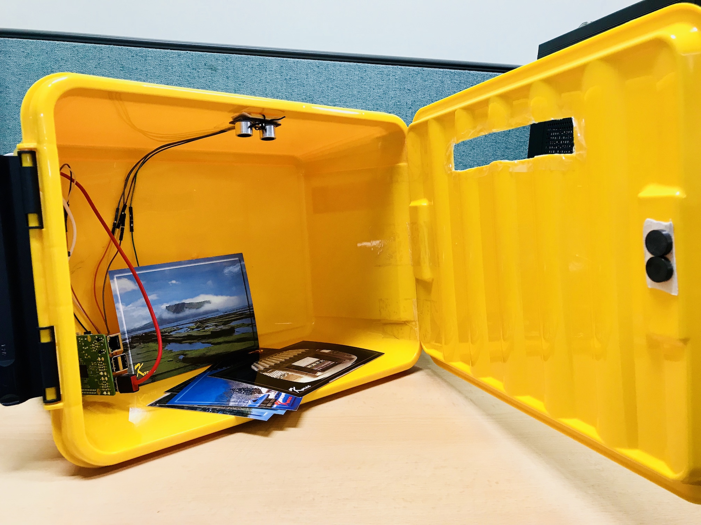
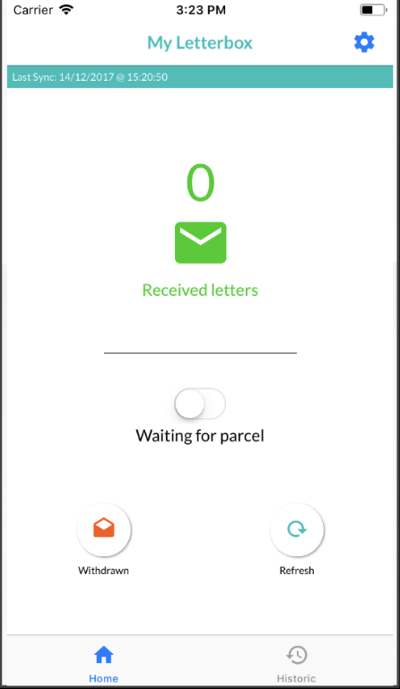
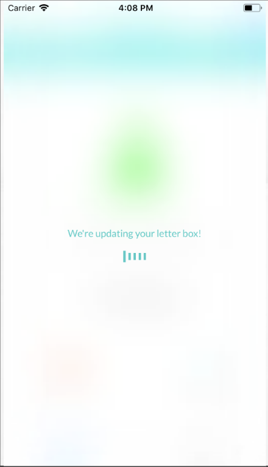
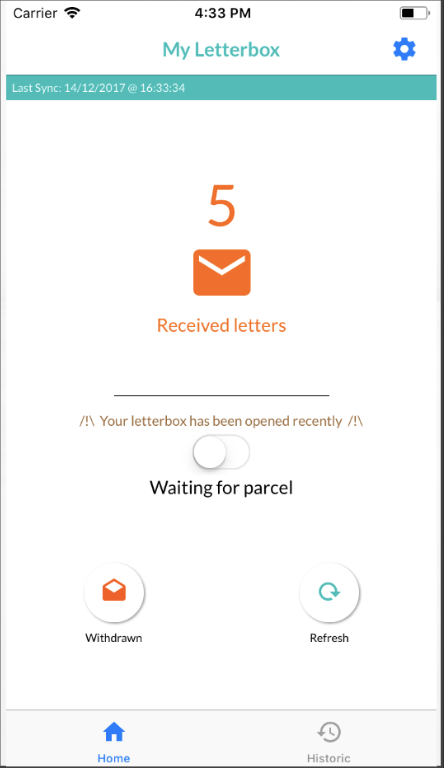
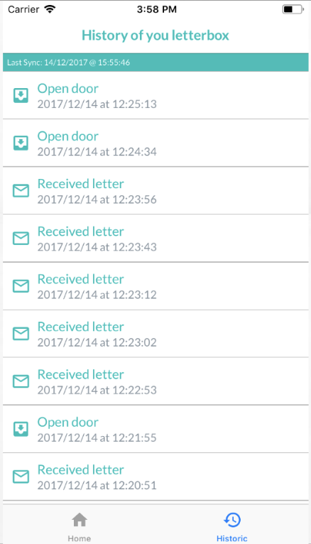
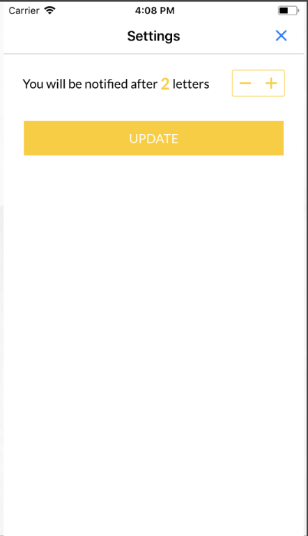

# Connected letterbox

  

To let users being informed of their letters and parcels delivery, I had the idea of creating the Smart Letter Box. 
Smart Letterbox is a smart device designed to help its users manage daily their letters and parcels by notifying them each time their letterbox has been opened or something has been introduced in it.

## Capabilities

1. Get the amount of letter in your letterbox
1. Set a threshold before withdrawal
1. Say if you’re waiting for a parcel
1. **Be notified** of letterbox activity: whether the door has been open and if you’re threshold of letters has been reached

## Usability Requirements

1. Users can remotely check if they have something in his letterbox. User has to know how many letters and parcels they have in their letterbox through a mobile application and a letter counter / a parcel counter.
1. Users receive a notification on their smartphone if they reach a specific amount of letters that he had specified. An option to configure this number is available.
1. An option to precise either the user is waiting for a parcel or not is available as well. Possibility to configure his account to be connected to a specific letterbox.

## Architecture

### Letterbox

A Raspberry PI 3 was installed in a letterbox with 2 sensors. The raspberry is in charge of sending data through WIFI to the cloud. The two sensors are
- **Hall effect sensor** detects whether the door is opened or not
- **Sonar sensor** (IR would have been better) detects the mail delivery

### AWS

AWS is used to manage the state of each application. I was using 3 main AWS services: 
- **AWS IoT** - used with topics & shadow to store state)
- **SNS** - to send notification of emails and parcel delivery
- **DynamoDB** - to store all applications data

Some lambda were used to trigger SNS notifications based on AWS IoT rules.

### Mobile app

    
    
    
    
    

A mobile app built in React Native used to:
- see how many mais are in the letterbox
- set the threshold for notification
- see history

> At the time there were no AWS SDK to use AWS IoT easily, so I had to built something on top of the AWS JS SDK

## Improvements
1. (FIRST THING TO DO) Update app and clean the code! 
1. Change sensors
1. Miniaturize
1. Connect several sensors to the same raspberry
1. Support user account and possibility to subscribe for different letter box in the same application

